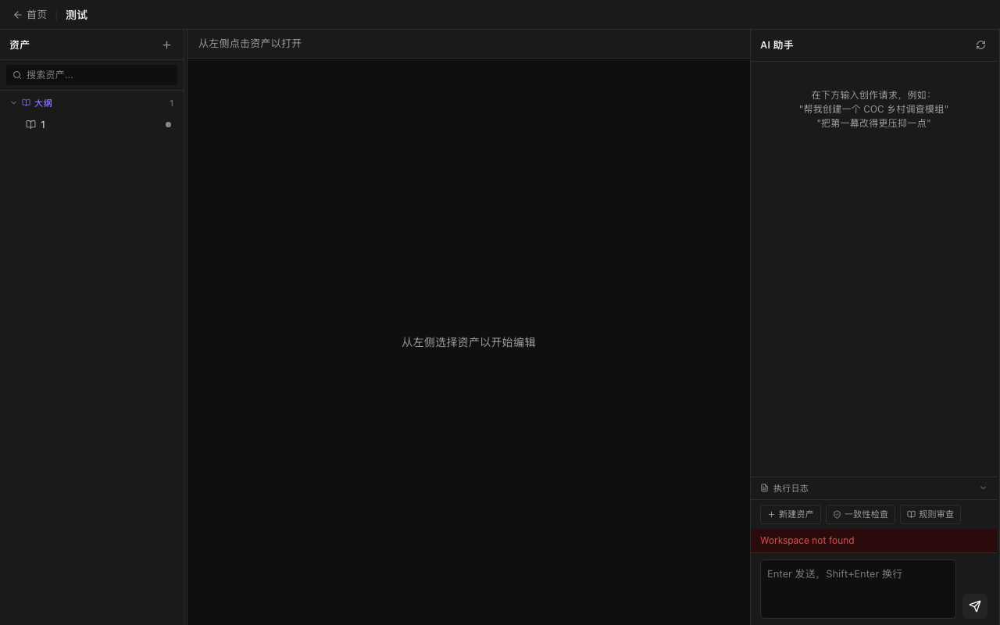
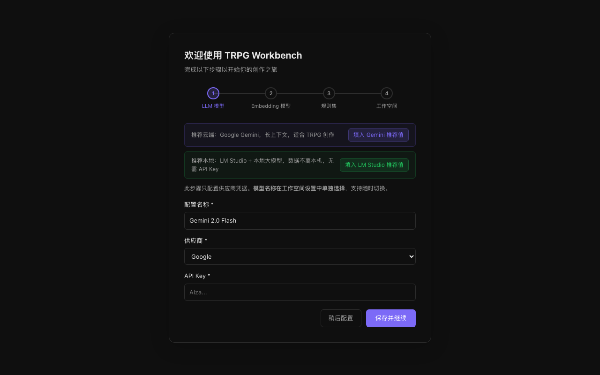

<div align="center">
  

  # TRPG Workbench

  **本地优先的 TRPG 主持人创作工作台**

  类 IDE 桌面应用，辅助 KP/GM 完成剧本撰写、NPC/怪物设计、线索编排、知识库检索等工作。

  [](https://github.com/shitlsh/trpg-workbench/releases)
  [](#安装)
  [](LICENSE)
  [](https://github.com/shitlsh/trpg-workbench/actions)

  [下载安装包](#安装) · [本地开发](#本地开发) · [路线图](.agents/plans/roadmap.md)
</div>

---



## 功能概览

- **多工作空间** — 每个剧本独立工作空间，资产完全隔离
- **AI 创作辅助** — 对话式 Agent 协助撰写 NPC、场景、线索，支持 OpenAI / Anthropic / Google Gemini / 兼容接口
- **结构化资产** — NPC、怪物、地点、线索、场景等类型化资产，带版本历史回溯
- **知识库** — 导入 PDF/CHM 规则书，自动切块向量化，AI 可按需检索引用
- **Prompt 管理** — 可视化编辑 system prompt，创建多套 Prompt Profile 随时切换
- **双向链接** — 资产内 `[[双链]]` 语法，可视化关系图
- **模组手册导出** — 一键生成 PDF

## 安装

> [!NOTE]
> v0.1.0 为未签名测试版，首次运行需手动授权（见下方说明）。

从 [Releases](https://github.com/shitlsh/trpg-workbench/releases) 页面下载对应平台安装包：

| 平台 | 文件 |
|------|------|
| macOS Apple Silicon | `TRPG.Workbench_*_aarch64.dmg` |
| macOS Intel | `TRPG.Workbench_*_x64.dmg` |
| Windows | `TRPG.Workbench_*_x64-setup.exe` |

<details>
<summary><strong>macOS — 绕过 Gatekeeper</strong></summary>

安装后如遇「无法打开，因为它来自身份不明的开发者」：

```bash
# 方法一：右键点击应用图标 → 选择「打开」→ 点击「打开」

# 方法二：命令行移除隔离属性
xattr -cr /Applications/TRPG\ Workbench.app
```
</details>

<details>
<summary><strong>Windows — 绕过 SmartScreen</strong></summary>

安装时弹出「Windows 已保护你的电脑」：点击「更多信息」→「仍要运行」。
</details>

### 首次配置

启动后会进入**配置向导**（4 步）：LLM 模型 → Embedding 模型 → 规则集 → 工作空间。各步均可跳过后补。



## 技术栈

| 层次 | 技术 |
|------|------|
| 桌面壳 | [Tauri 2](https://tauri.app) |
| 前端 | React 18 + Vite + TypeScript |
| AI 编排 | Python + Provider 原生 SDK（OpenAI / Anthropic / Google / OpenAI-compatible） |
| 数据库 | SQLite（via SQLAlchemy） |
| 向量索引 | lancedb |

## 本地开发

### 环境要求

- Node.js >= 20
- pnpm >= 9（`npm install -g pnpm`）
- Python 3.11+（推荐 3.13）
- Rust（`curl --proto '=https' --tlsv1.2 -sSf https://sh.rustup.rs | sh`）
- Tauri CLI（`cargo install tauri-cli`）
- macOS：需安装 Xcode Command Line Tools；如需 CHM 支持，需 `brew install chmlib`

### 安装依赖

```bash
# 前端依赖
pnpm install

# Python 后端依赖
cd apps/backend
python3 -m venv .venv
PIP_USER=false .venv/bin/pip install -r requirements.txt
```

### 启动开发服务器

**完整桌面应用（推荐）**

```bash
bash scripts/dev.sh
```

**仅调试后端**

```bash
cd apps/backend
PIP_USER=false TRPG_DATA_DIR=~/trpg-workbench-data .venv/bin/python3 server.py
# 后端监听 http://127.0.0.1:7821
```

### 仓库结构

```
trpg-workbench/
├── apps/
│   ├── desktop/              # React + Tauri 前端
│   │   ├── src/
│   │   │   ├── pages/        # 页面组件
│   │   │   ├── components/   # 通用组件（editor、agent、layout）
│   │   │   ├── stores/       # Zustand 状态
│   │   │   └── lib/          # API 客户端工具
│   │   └── src-tauri/        # Tauri / Rust 壳
│   └── backend/              # Python FastAPI 后端
│       └── app/
│           ├── api/          # HTTP 路由
│           ├── agents/       # Agent 运行时
│           ├── models/       # ORM + Pydantic Schema
│           ├── services/     # 业务逻辑
│           ├── workflows/    # 多步 Workflow
│           └── knowledge/    # PDF 解析、向量检索
├── packages/
│   └── shared-schema/        # 前后端共用 TypeScript 类型
└── .github/
    └── workflows/
        └── release.yml       # Mac + Windows 自动构建发布流水线
```

### 数据目录

运行时数据默认存储在 `~/trpg-workbench-data/`，可通过环境变量 `TRPG_DATA_DIR` 覆盖。

```
~/trpg-workbench-data/
├── app.db                    # SQLite 主数据库
├── .secret_key               # 本地加密密钥（勿提交）
├── workspaces/
│   └── <workspace-id>/
│       └── assets/           # 结构化资产（JSON + Markdown 双文件）
└── knowledge/
    └── libraries/
        └── <library-id>/     # 知识库索引和解析结果
```

> [!TIP]
> 可通过环境变量 `LLM_REQUEST_TIMEOUT_SECONDS`（正整数秒）为 LLM / Embedding 请求设置超时，不设置则由 SDK 默认行为决定。

## 贡献

本项目处于积极开发阶段。参与前请先阅读：

- [架构约束](.agents/skills/trpg-workbench-architecture/SKILL.md) — 整体技术选型与分层规范
- [里程碑路线图](.agents/plans/roadmap.md) — 当前状态与计划
